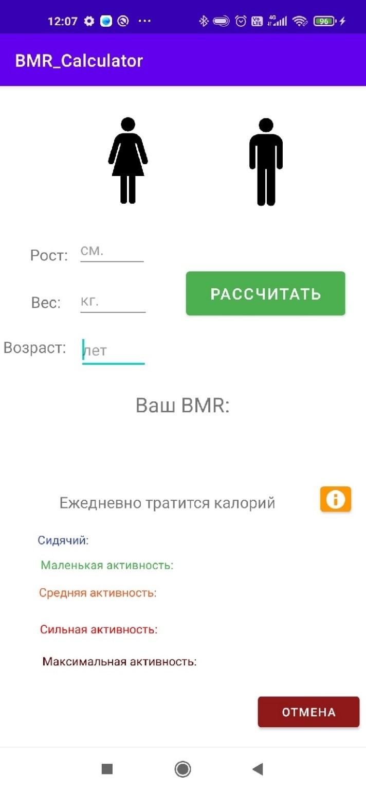

# BMR Calculator

## Purpose
### Technical requirements
This app allows an user to determine their BMR (the minimum amount of energy consumed by the human body to maintain their own life at rest) based on their gender, age, weight, and height.
BMR is used as an estimate to measure an adult's metabolism, which varies with height, weight, age, and various medical factors.

## How to build
build requirements:
- Install Android SDK
- Install JDK
- Java version "1.8"
- Run gradlew script
```bash
gradlew build
```

## How to run
tbd
